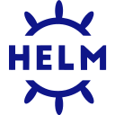
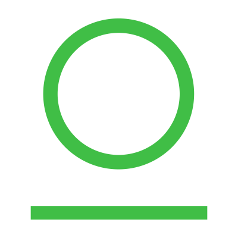

<a href ="My Resume">

<h2> Hi! I'm Jenny Dolan. </h2>

I have 15+ years as a technical leader with a successful track record in delivering platform capabilities which enable software engineering organizations to deliver performant, stable, and reliable experiences into the hands of digital customers. Recent platform initiative at CVS was awarded an excellence nomination and resulted in a 12X increase in production delivery with implicit security and reliability (i.e. production deployments went from 60 per week to 725 per week). I have a diverse background in software engineering which includes website/mobile development, data management, secure application delivery frameworks CICD, infrastructure as code and talent management.

* **Improve Business Agility** - Using Agile Methodologies and my versatile development experience, I will work alongside your team to build, develop and deploy IT platform solutions that will break down organizational silos and inefficiencies that hinder business productivity and innovation.

* **DevSecOps** - I can help you integrate supply chain security practices into your build and deploy pipeline. We can create a self-service pipeline that utilizes github actions workflow (or CICD tools of your choice) which incorporate static code analysis, software composition analysis, container scanning, cosign, mobile scan, SBOM (Software Bill of Materials) generation and DAST (Dynamic Application Security Testing). I can improve the developer experience by enabling keyless authentication and automatically synce secrets with your Secrets Management Provider to seemlessly deploy k8s reources to cloud enivronments such as: &nbsp; &nbsp;and &nbsp;.

* **Platform Business Model** - I will partner with your leadership to drive a data driven mindset and to make sure you have the necessary OKRs, KPIs and visibility to your entire cloud enterprise. I will work collaboratively to fine tune your platform business model which includes Common Ways of Working, Platform Feature Delivery Teams and Core Operations to ensure longterm success and sustainability. 

  - *Common Ways of Working* will address staffing, procurement, training resoures, product team routines, desktop computing and standard business tools. 

  - *Platform Delivery Teams* are comprised of platform "feature" teams that maintain end-to-end platform capabilties such as:

    - Cloud Architecture Ramp: Cloud Engineering, Security & Networking
    - Core DevX Features: Self Service Application Delivery Pipeline
    - Infrastructure Provisioning: Self Service Infrastructure Pipeline

  - *Core Operations* is focused on reliability to address Technical Support, Incident Management, Production Change Management and Site Reliability Engineering (SRE). SRE will ensure that all production applications integrate with observability services and how to leverage prebuilt dashboards, logs, metrics, and traces to continuously monitor, detect and resolve problems. By coaching teams to adopt platform thinking and practices that better address technical debt, we can create a more responsive engineering culture and happier teams!
 

<h2>Get In Touch</h2>
Click on link to contact me:
  

<h2> Tech Stack </h2>

Here are a few things I've picked up along my learning journey:

  &nbsp;
  &nbsp;
  &nbsp;
  &nbsp;
  &nbsp;
  &nbsp;
   &nbsp;
  &nbsp;
  &nbsp;
  &nbsp;
  &nbsp;
  &nbsp;
  &nbsp;
  &nbsp;
  
  &nbsp;
  &nbsp;
  &nbsp;
  &nbsp;
  &nbsp;
  &nbsp;
  &nbsp;
  &nbsp;
  &nbsp;
  &nbsp;
  &nbsp;
  &nbsp;
  &nbsp;
  &nbsp;
   &nbsp;
   &nbsp;
  &nbsp;
  &nbsp;
  &nbsp;

<h2>Github Stats:<h2>

